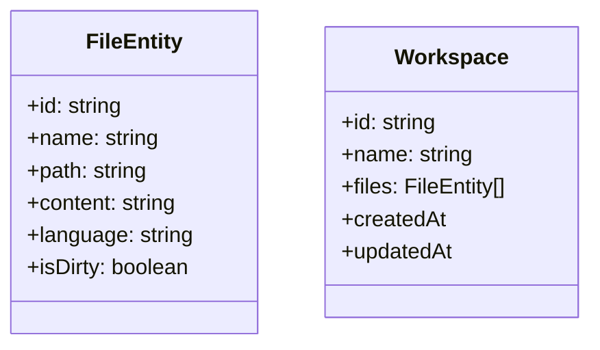

## 1. 目的とコンセプト

| 項目      | 内容                                                               |
| ------- | ---------------------------------------------------------------- |
| 主目的     | ブラウザ上で完結する軽量 IDE を提供し、インストール不要・オフライン対応でコーディング／実行／デバッグを行える環境を実現する |
| 想定ユーザ   | 学習者・教育機関、ハッカソン参加者、外出先で簡易編集したい開発者                                 |
| コアメッセージ | “開けばすぐ書ける・動く・共有できる”                                              |

---

## 2. 全体構成

```
┌───────────────┐
│  UI Layer     │  React / Preact + Tailwind（任意）
├───────────────┤
│  IDE Core     │  Monaco Editor / CodeMirror 7
│               │  xterm.js（ターミナル）,  ESLint + Prettier (WebWorker)
├───────────────┤
│  Runtime Hub  │  Web Workers / WebAssembly  ↔  Sandboxed IFrame
├───────────────┤
│  Storage      │  IndexedDB / File System Access API
└───────────────┘
```

* サーバ不要版ではすべてクライアント側で完結
* オンライン版では WebSocket 経由でリモートコンパイルや LSP を呼び出せる拡張ポイントを用意

---

## 3. 主要機能

### 3.1 エディタ

| 機能          | 詳細                                                      |
| ----------- | ------------------------------------------------------- |
| シンタックスハイライト | Monaco / CodeMirror、言語は JS, TS, HTML, CSS, Python を初期同梱 |
| インテリセンス     | 基本補完 ＋ LSP over WebWorker（TypeScript, JSON など）          |
| コードフォーマット   | Prettier 実装、保存時自動整形                                     |
| マークダウンプレビュー | Split-view でライブレンダリング                                   |

### 3.2 ファイル / プロジェクト管理

* **ワークスペースツリー**（仮想 FS）
* **ドラッグ＆ドロップ** でローカルファイル読込
* **保存**:

  * IndexedDB（自動バックアップ）
  * File System Access API（ユーザ許可時に実ファイル保存）

### 3.3 実行・デバッグ

| ランタイム                 | 実装                                                     |
| --------------------- | ------------------------------------------------------ |
| JavaScript/TypeScript | Sandboxed iframe + ES Module で即時実行                     |
| WebAssembly demo      | Rust/Wasm sample 実行 (optional)                         |
| Python (pyodide)      | WebAssembly 版 CPython で REPL                           |
| コンソール                 | xterm.js；実行結果 / stdout / stderr を表示                    |
| デバッグ                  | `console.*` フック、StackTrace API、ブラウザ DevTools Deep-Link |

### 3.4 UI/UX

* **レイアウト**: ツリービュー（左）、タブ付きエディタ（中央）、ツールパネル/ターミナル（下部）
* **テーマ**: Light / Dark、VSCode 互換配色 JSON 読込
* **キーバインド**: VSCode 準拠 & Vim/Emacs プラグイン切替
* **多言語**: i18n JSON 辞書ロード（初期は ja / en）

### 3.5 拡張プラグイン機構

1. `manifest.json` でメタ情報宣言
2. ES Module 形式で `register(api)` を export
3. IDE 側 `window.IDE.registerPlugin()` でフック—

   * コマンド追加
   * サイドバー／パネル UI 注入
   * エディタアクション登録

---

## 4. 非機能要件

| カテゴリ     | 要件                                            |
| -------- | --------------------------------------------- |
| パフォーマンス  | 初期ロード < 3 s（HTTPS/HTTP2、コード分割 & lazy loading） |
| オフライン    | Service Worker による PWA キャッシュ、オフライン編集＆保存       |
| セキュリティ   | CSP strict-dynamic、sandboxed iframe で実行環境を隔離  |
| アクセシビリティ | WCAG 2.1 AA、キーボード操作 100% 対応                   |
| モバイル対応   | 768 px 以上で IDE フル機能、狭い幅では Read-only モード       |

---

## 5. 技術スタック詳細

| 領域            | 採用 OSS / API                                    |
| ------------- | ----------------------------------------------- |
| エディタコア        | **Monaco Editor 0.50+**（MIT）                    |
| ターミナル         | **xterm.js 5.x**                                |
| Lint / Format | **ESLint 9+**, **Prettier 3+** （WebWorker 実行）   |
| ビルド           | Vite / esbuild in-browser（Workers）              |
| デプロイ          | Static hosting (GitHub Pages, Cloudflare Pages) |
| テスト           | Playwright + Vitest (headless)、Lighthouse CI    |

---

## 6. データモデル & ストレージ



* **IndexedDB スキーマ**: `workspace -> files[]`
* **Migration**: バージョンアップ時に旧 Schema を自動変換

---

## 7. UI 画面リスト（抜粋）

1. **IDE メイン**（エディタ＋ターミナル）
2. **設定ダイアログ**

   * テーマ / フォント / キーバインド
3. **プラグインマネージャ**

   * Marketplace-like カード UI
4. **About / バージョン情報**

---

## 8. ロードマップ (MVP → v1.0)

| フェーズ | 期間      | 主要マイルストーン                      |
| ---- | ------- | ------------------------------ |
| MVP  | 1 ヶ月    | エディタ＋実行＋保存 (JS/HTML/CSS)       |
| Beta | +1 ヶ月   | ターミナル & Python (pyodide)、テーマ切替 |
| RC   | +1 ヶ月   | プラグイン機構、i18n、PWA 完全対応          |
| v1.0 | +0.5 ヶ月 | パフォーマンス最適化・UX磨き込み、ドキュメント公開     |

---

## 9. テスト & QA

* **ユニットテスト**: エディタ API フック、ストレージ DAO
* **E2E**: Playwright でファイル作成→実行→Reload→状態復元シナリオ
* **パフォーマンステスト**: 1 MB file, 1000 file workspace で 60 fps 以上
* **セキュリティレビュー**: DOMPurify による HTML sanitize、CSP audit

---

## 10. ライセンス方針・配布

* OSS (MIT) 基盤、商用利用可
* サードパーティーライブラリはすべて MIT / Apache-2.0 を選定
* コード生成系プラグインのみ GPL を避け、企業利用しやすく

---

## 11. 今後の拡張アイデア

* **クラウド同期**: GitHub OAuth 連携で Gist / Repo に Push
* **AI 補完**: WebSocket 経由で LLM API (OpenAI, Claude) を呼び出し
* **コラボレーション**: CRDT + WebRTC でリアルタイム同時編集
* **デバッグ強化**: wasm-gdb, source-map 連携ブレークポイント
